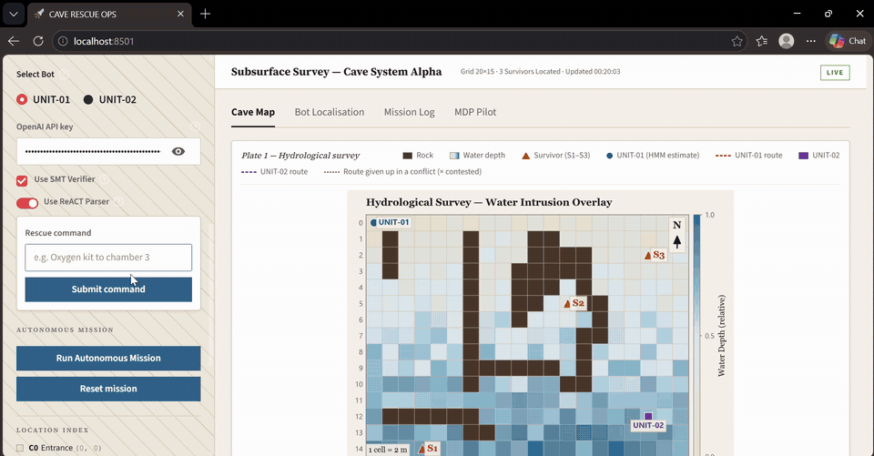
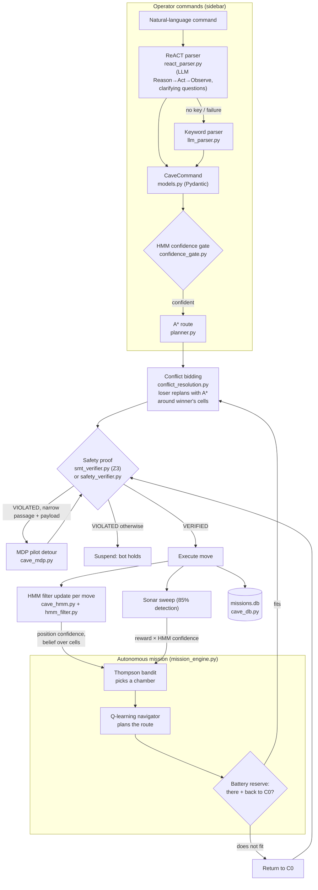

# Cave Rescue Coordination System

A simulated command centre for two rescue robots searching a flooded cave. An operator types orders in plain English
("oxygen kit to chamber 3"), which a ReACT LLM loop (or a keyword parser) turns into a validated command. A* plans the
route, a two-bot bidding protocol resolves shared cells, and a Z3 SMT solver proves the route safe before anything
moves: passages wide enough for the load, no deep water, enough battery. UNIT-01 navigates without GPS: a hidden
Markov model tracks its position from noisy sonar wall counts, and it may only navigate once that belief is
concentrated. An autonomous mode lets UNIT-01 search on its own. A Thompson-sampling bandit, weighted by the HMM's
confidence, picks the next chamber. Q-learning drives there, each sonar sweep updates the bandit, and the bot returns
to base before its battery runs out. An MDP pilot (policy/value iteration) proposes detours when a route is blocked.
Every mission is logged to SQLite and shown on a Streamlit dashboard.



*Demo at 4× speed. Full-length recording (4 min): [demo.mp4](demo.mp4)*

---

## Architecture



ASCII view of one autonomous cycle:

```
   ┌──────────────┐  weights by HMM reach   ┌──────────────┐   route    ┌───────────────────┐
   │ Thompson     │ ──────────────────────► │ Q-learning   │ ─────────► │ battery reserve   │──► too low: return to C0
   │ bandit       │                         │ navigator    │            │ (there + home)    │
   └──────▲───────┘                         └──────────────┘            └─────────┬─────────┘
          │ reward × HMM confidence                                              │ fits
   ┌──────┴───────┐   real wall counts    ┌──────────────┐  VERIFIED  ┌──────────▼────────┐
   │ sonar sweep  │ ◄──────────────────── │ HMM filter   │ ◄───────── │ conflict bid +    │
   │ (85% detect) │                       │ per move     │   move     │ Z3 SMT proof      │
   └──────────────┘                       └──────────────┘            └───────────────────┘
```

---

## Files

### Application and mission logic

| File | What it does |
|---|---|
| `app.py` | Streamlit dashboard: sidebar (bot selector, API key, verifier/parser toggles, command form, autonomous button), result banners, parse trace, and four tabs: cave map, HMM localisation, mission log, MDP pilot. Runs the manual command pipeline (parse → gates → A* → conflict bid → verify → execute) and delegates state and the autonomous loop to `mission_engine.py`. |
| `mission_engine.py` | Headless mission core. `MissionSim` works on any dict-like store (`st.session_state` in the app, a plain dict in tests and eval): logging, HMM belief updates and sonar scans, route verification (SMT or rule-based), conflict bidding and rerouting, the Q-learning navigator, and `run_autonomous_mission()`, which returns a `MissionResult`. |
| `autonomous_mission.py` | `ThompsonBandit` (Beta-Bernoulli Thompson sampling over chambers), `HMMCoupling` (HMM position confidence and per-chamber reach weights), `QLearningNavigator` (tabular Q-learning, one Q-table per target, flooded cells as walls when SMT is on), and the 85% sonar detection model. |
| `conflict_resolution.py` | Two-bot cell bidding: `bid = priority_weight × battery / moves`. The loser replans with A* treating contested cells as rock, repeating until its detour shares no cell with the winner's route; with no detour it holds. |
| `smt_verifier.py` | Z3 proof that a route satisfies every safety rule at once (see [SAFETY.md](SAFETY.md)); returns `VERIFIED`/`VIOLATED` with one labelled reason per failing rule. |
| `safety_verifier.py` | Rule-based fallback verifier with the same rules (water checked at the target only), plus the shared constants: bot diameters, water limit, battery drain. |
| `react_parser.py` | ReACT parse loop: up to 3 LLM iterations that either emit `PARSED: {json}` or `CLARIFY: question`. Validation errors are fed back to the model; the loop pauses for the operator's answer in Streamlit and falls back to the keyword parser on any failure. |
| `llm_parser.py` | One-shot LLM parser (`gpt-4o-mini`, structured output) and the deterministic keyword parser; chamber map and names. |
| `models.py` | `CaveCommand` Pydantic model (action, chamber 0–9, payload, priority, bot, raw text) and the A* `Node`. |
| `confidence_gate.py` | Blocks navigation while the HMM belief entropy is ≥ 3.5 nats ("run SCAN first"). |
| `cave_environment.py` | 20×15 cave grid (247 open cells): rock layout, per-cell water level and passage width, survivor cells, `RescueBot` state, fleet start positions, sonar wall-count observation. |
| `cave_hmm.py` | `CaveHMMLocaliser`: wraps the lab HMM for the cave (padded border, sonar accuracy 0.65), belief entropy, most-likely position. |
| `cave_mdp.py` | `CaveMDPPilot`: cave as an MDP (80/10/10 slip, +100 survivor, −1 step, −10 deep water), solved by the lab policy/value iteration engines; replans with blocked cells and traces the policy route. |
| `cave_db.py` | SQLite `missions` table (command, parsed intent, path, verdict and reason, battery before and after, position, algorithm, bot). One connection per call, so it is safe under Streamlit's threads. |
| `planner.py` | A* search (Manhattan or Euclidean heuristic) over the grid. |
| `eval.py` | Runs N headless autonomous missions with different seeds and writes `eval_results.csv` plus a summary. |
| `test_flow.py` | End-to-end test script (18 checks, see [Tests](#tests)). |

---

## Install and run

Requires **Python 3.13** (tested on 3.13.5).

```bash
pip install -r requirements.txt
streamlit run app.py
```

Then open http://localhost:8501. An OpenAI API key is optional: without one, commands go through the keyword parser.
The key is entered in the sidebar and kept only for the session.

Example commands: `oxygen kit to chamber 3`, `urgent medkit to the deep pocket`, `scan`, `status`, `unit 2 go to chamber 9`.

## Tests

```bash
python test_flow.py
```

18 checks, about 30 seconds. They cover the cave, A*, HMM, safety checks, the parsers (no-key fallback), the SMT
verifier, the bandit and Q-learning, HMM coupling (an uncertain belief favours nearby chambers and weakens updates),
all four autonomous exits (all survivors found, battery reserve, early stop, cycle cap), conflict rerouting of
UNIT-02, and an end-to-end app run where a loaded bot is rerouted around narrow passages on the MDP detour. The app
test writes to a temporary database, so `missions.db` is never touched.

## Evaluation

```bash
python eval.py                 # 100 missions, SMT verifier on (the app default)
python eval.py --smt off       # rule-based verifier
```

The script prints a summary table and writes one row per mission to `eval_results.csv`: seed, survivors found,
cycles used, exit reason, battery remaining, and whether early stop, the battery reserve or the cycle cap fired. The
seed drives the bandit and the sonar detection draws; the Q-learning navigator is trained once and shared
(`--fresh-navigator` retrains it per mission).

Results from the committed run (100 missions each, seeds 0–99):

| | SMT on (default) | SMT off |
|---|---|---|
| Survivors found (mean) | 1.97 / 3 | 2.86 / 3 |
| Missions finding all 3 | 0% | 86% |
| Cycles used (mean) | 25.5 | 16.0 |
| Battery left (mean) | 1.3 min | 11.0 min |
| Exit: all survivors found | 0% | 86% |
| Exit: battery reserve | 85% | 14% |
| Exit: cycle cap | 15% | 0% |
| Early stop fired | 0% | 0% |
| Ended at base | 100% | 14% |

With SMT on, S1 in the Lower Sump (C2) is unreachable: every route into it crosses water at or above 0.8, so the
mission spends its battery re-sweeping the other chambers and then goes home. With SMT off, 86% of missions find all
three survivors.

---

## The autonomous mission loop

Press **Run Autonomous Mission** in the sidebar. UNIT-01 searches chambers C1–C9 on its own; a live panel shows the
phase (SCANNING / NAVIGATING / UPDATING BELIEF / REWARD UPDATE), the details, and the bandit's table, with a short
pause after each phase.

Each cycle:

1. **SCANNING.** If the HMM belief is too spread out (entropy ≥ 3.5), the bot takes a stationary sonar sweep first.
   The Thompson bandit then draws a sample from each chamber's Beta posterior and picks the highest weighted draw.
2. **NAVIGATING.** The Q-learning navigator plans a route; flooded cells are walls to it while SMT is on. The
   **battery reserve** check needs the trip there plus the learned route back to C0 to fit in the remaining
   battery; if it doesn't, the bot goes home. The route is bid against UNIT-02's route in progress, then proved by
   the active verifier before the bot moves.
3. **UPDATING BELIEF.** One HMM predict/update step per move, using the real wall count at each cell.
4. **REWARD UPDATE.** A sonar sweep of the chamber detects a survivor who is there with probability 0.85 and never
   gives false positives. A detection is reward 1, an empty sweep reward 0. Found survivors are rescued and their
   chamber leaves the search.

The mission ends when:

| Ending | Then |
|---|---|
| All survivors found | Stops where it is |
| Early stop: every remaining chamber's posterior mean < 0.2 | Returns to C0 |
| Battery reserve: next trip + return no longer fits | Returns to C0 |
| Cycle cap (30 cycles) | Returns to C0 |
| Battery cannot make one move / no reachable chambers / still uncertain after a scan | Stops where it is |

### How the HMM couples into the bandit

`HMMCoupling` reads the live HMM belief, restricted to the 247 open cells and renormalised.

- **Position confidence** `c = 1 − H(belief) / ln(247)`: 1 when the bot is sure of one cell, 0 when the belief
  is uniform.
- **Selection.** For each chamber, the expected number of moves to reach it, averaging over every cell the bot
  might be in weighted by its probability (breadth-first distances on the navigator's grid), gives a reach weight
  `exp(−(1 − c) × expected_moves / 10)`. Each Thompson draw is multiplied by its chamber's weight. A well-localised
  bot is barely biased; an unsure one strongly prefers chambers that are close under its belief, where it is least
  likely to get lost.
- **Update.** An empty or successful sweep adds `c` to β or α instead of 1, so an observation taken while the bot
  is unsure it is really in that chamber counts for less.

### Conflict resolution between the two bots

When a route shares cells with the other bot's route in progress, each bot bids
`priority_weight (high 2, normal 1, low 0.5) × battery / moves`. The higher bid keeps its route; ties go to UNIT-01.
The loser replans with A*, treating the contested cells as rock and adding any further cells where the detour
touches the winner's route, until the detour shares no cell with the winner's route. The detour is safety-checked
before it is applied. If there is none (for example the contested cell is the loser's own start or goal), the loser
holds and its battery for the cancelled route is refunded. The mission log shows the bids and a `CONFLICT REROUTE`
line with the new route. The map draws the route given up as a dotted line, marks the contested cells with ×, and
shows the bot's new route dashed.

---

## Limitations

- **SMT on blocks flooded chambers.** The SMT verifier rejects any route through water ≥ 0.8. Every route into the
  Lower Sump (C2, survivor S1) and the Lower Gallery (C8) crosses such water, so with SMT on S1 is never found
  (0% in the evaluation). Switching the verifier off reaches them but only checks water at the destination.
- **Sonar detection is 85%.** A survivor can be missed. Empty sweeps are evidence, not proof, which is why chambers
  are revisited.
- **Cycle cap of 30.** Raised from 20 after HMM-weighted updates made posteriors fall more slowly. With SMT on, 15%
  of evaluation missions hit it.
- **Early stop rarely fires.** At a posterior-mean threshold of 0.2 it fired in 0 of 200 evaluation missions; the
  battery reserve or the cycle cap ends the search first. The Beta posterior does not model the 85% detection rate,
  so it falls more slowly than the true probability that a chamber is occupied.
- **No multi-bot coordination in autonomous mode.** Only UNIT-01 searches. UNIT-02 does not take part; its route
  in progress is still respected through the bidding protocol, and it is rerouted or held if it loses.
- **Missions complete instantly.** A move is applied in one step and the route stays "in progress" (reserved for
  bidding) until that bot's next mission; there is no time-stepped motion or collision in time.
- **Ending at a survivor.** When every survivor is found the bot stays at the last chamber rather than returning
  to base (86% of SMT-off evaluation missions end this way).
- **Simulation only.** Sensor models, battery drain (0.1 min per move) and detection rates are assumptions. See
  [SAFETY.md](SAFETY.md).

## Safety considerations

- **Formal route proof.** Every route a bot drives, whether from a command, the autonomous loop, a return to base or
  an MDP detour, is proved by the Z3 SMT verifier, or checked by the rule-based verifier when SMT is switched off.
  Nothing moves on a `VIOLATED` result.
- **Passage width.** A passage must be strictly wider than the bot: 0.25 m empty, 0.6 m carrying any payload. Ten
  cells are too narrow for a loaded bot. When a loaded route fails only on width, the MDP pilot plans a detour
  around those cells (and around flooded cells when SMT is on); the detour drives only if it is itself verified.
- **Water.** SMT rejects water ≥ 0.8 on every cell of the route; the MDP pilot is penalised for water above 0.6.
- **Battery.** Every route must use strictly less than the remaining battery. In autonomous mode the battery
  reserve also keeps enough for the learned route home.
- **Why the bot returns to base.** A bot stranded in a flooding cave with a flat battery is a second rescue. Early
  stop, the cycle cap and the battery reserve all end with a verified drive back to C0, so the robot can be
  recovered, recharged and redeployed.
- **Localisation gate.** UNIT-01 may not navigate while its position belief is too uncertain; it must scan first.

The full list of properties, responses and known failure modes is in [SAFETY.md](SAFETY.md).
